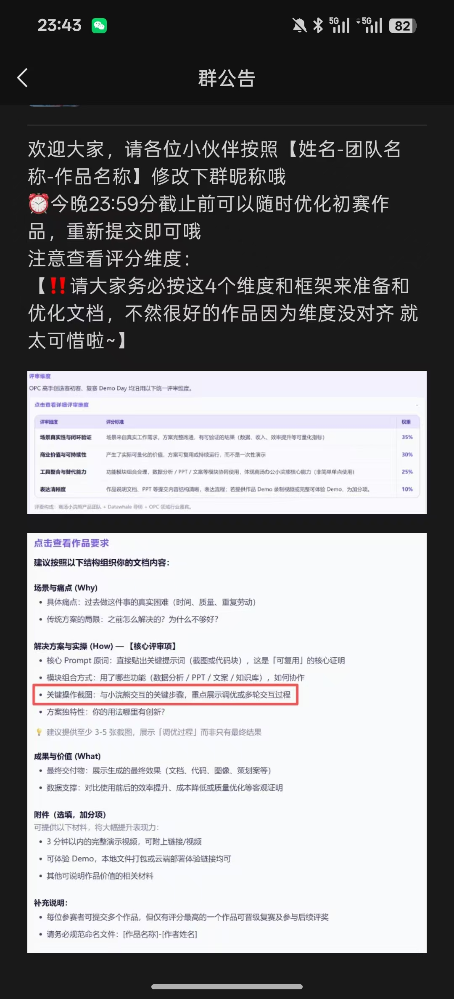
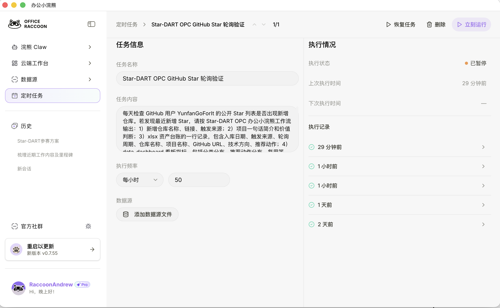
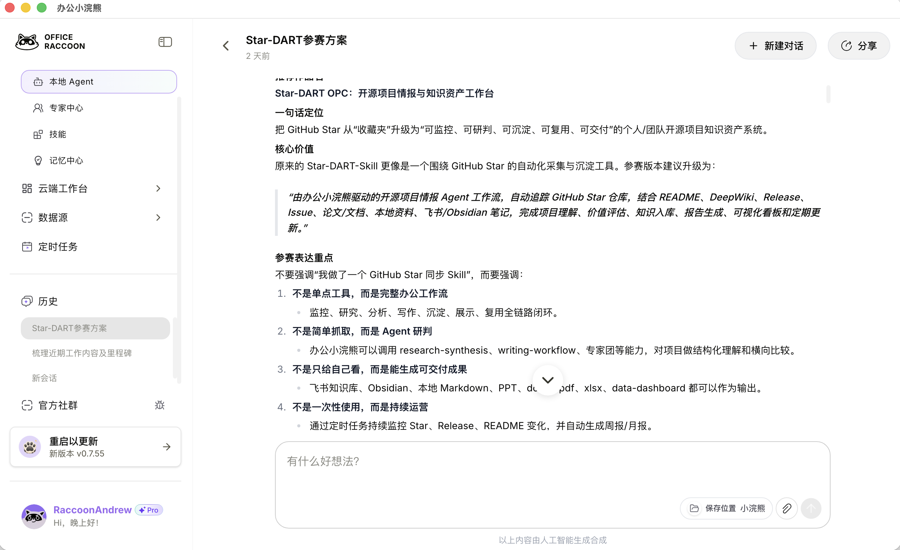
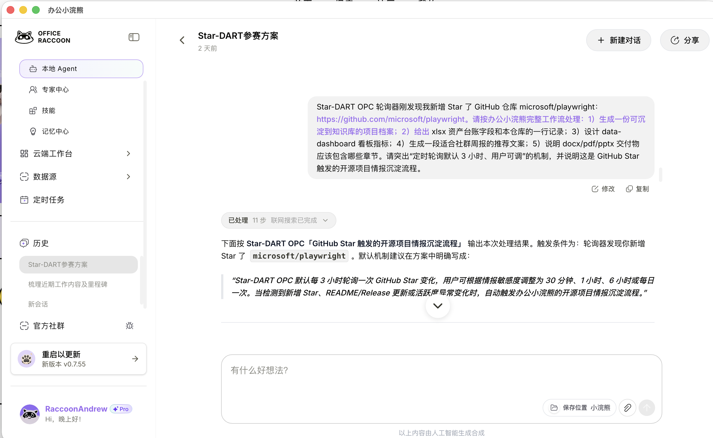

# Star-DART

**让你的 Star 列表成为可检索、可复用的个人知识库。**

Star 了大量开源项目，当下觉得"以后用得上"，过段时间只剩模糊记忆。真正需要时翻遍 Star 列表也找不到，或者找到了懒得重新看。

Star-DART 的目标：**把"看过"变成"能用"。** 一旦你 Star 了新仓库，系统通过定时轮询发现变化，自动生成高质量中文文档，保存到飞书知识库，配合多维表格索引，让收藏变成真正掌握。

工作原理：系统常驻服务默认每 **3 小时** 调用 GitHub API 获取最近星标，用户可通过 `POLL_INTERVAL` 自行调整轮询间隔。发现新仓库时向 Agent 发送任务。Agent 接到任务后，结合 DeepWiki 概述与 README 生成结构化中文文档。通过**飞书CLI**保存到飞书知识库，并创建多维表格索引。整个流程自动化运行，无需手动干预。文档产出具备统一结构（定位、亮点、架构、快速开始、边界等），不是简单的翻译。未来只要搜索关键词或按分类浏览，就能快速回到当初的判断与用法。

**主动触发，现在看懂，未来找回，随时复用。让你的GitHub Star仓库变为你的专属开源项目知识库。**

---

## 👋 如果你是人类

把这个发给 Agent：

> 请阅读 https://github.com/YunfanGoForIt/Star-DART-Skill 的 README，按照指引安装和配置 Star-DART Skill。

---

## 🤖 如果你是 Agent

请仔细阅读下方安装指南，完成安装后引导用户配置。

### 安装流程

**1. 安装 lark-cli**
```bash
npm install -g @larksuite/cli
lark-cli config init
lark-cli auth login --recommend
```

**2. 克隆项目**
```bash
git clone https://github.com/YunfanGoForIt/Star-DART-Skill.git ~/Star-DART
cd ~/Star-DART
```

**3. 安装 Python 依赖**
```bash
python3 -m venv .venv
source .venv/bin/activate
pip install -r requirements.txt
```

**4. 配置环境变量**
```bash
cp .env.example .env
```

在 `.env` 中填写以下必填项：

| 变量 | 说明 | 获取方式 |
|------|------|----------|
| `GITHUB_TOKEN` | GitHub API Token | GitHub Settings → Developer settings → Fine-grained tokens → Starring: Read |
| `WEBHOOK_TOKEN` | OpenClaw Webhook Token | OpenClaw 的 `openclaw.json` 中 `hooks.token` |
| `FEISHU_WIKI_SPACE_ID` | 飞书知识库 Space ID | `lark-cli wiki spaces list` |
| `FEISHU_BASE_TOKEN` | 飞书多维表格 Token | 在知识库中创建多维表格后获取 |
| `FEISHU_TABLE_ID` | 飞书多维表格 Table ID | 同上 |

可选：
- `FEISHU_CHANNEL_ID` — 飞书群 ID，不填则不发送通知
- `OPENCLAW_AGENT_ID` — 留空使用默认 agent
- `POLL_INTERVAL` — 轮询间隔，默认 10800 秒（3 小时），可自行调整

**5. 创建飞书知识库多维表格**

在飞书知识库（Space ID 填入 `FEISHU_WIKI_SPACE_ID`）中创建多维表格，包含以下字段：

| 字段 | 类型 |
|------|------|
| 仓库名 | 文本 |
| 加入时间 | 创建时间（自动） |
| 一段话简介 | 文本 |
| 飞书文档链接 | 文本 |
| 一级分类 | 文本 |
| 详细标签 | 文本 |

**6. 启动**
```bash
python scripts/webhook_poller.py
```

**演示模式（无需真实 Token）**
```bash
python scripts/webhook_poller.py --dry-run --once --sample examples/sample_starred_repo.json
```

演示模式用于参赛展示：它不访问 GitHub、OpenClaw 或飞书，只输出新增 Star 被发现后应交给办公小浣熊处理的标准任务说明。

**7. 配置系统服务（可选）**

Linux:
```bash
cp services/linux-systemd.service ~/.config/systemd/user/star-dart.service
# 编辑路径
systemctl --user daemon-reload
systemctl --user enable --now star-dart.service
```

macOS:
```bash
cp services/macos-launchd.plist ~/Library/LaunchAgents/com.star-dart.ghstar.plist
# 编辑路径
launchctl load ~/Library/LaunchAgents/com.star-dart.ghstar.plist
```

---

## 项目结构

```
Star-DART/
├── README.md                 # 本文件
├── SKILL.md                  # Agent Skill 定义
├── .env.example              # 环境变量模板
├── requirements.txt           # Python 依赖
├── scripts/
│   └── webhook_poller.py     # 轮询脚本
├── references/
│   ├── doc_template.md       # 文档结构模板
│   ├── deepwiki_mcp.md       # DeepWiki MCP 调用
│   ├── tags.md               # 一级分类（11 个）
│   ├── tags.json             # 详细标签
│   └── feishu_card.md        # 飞书卡片格式
└── services/                 # 系统服务配置
```

---

## 依赖说明

| 依赖 | 版本 | 说明 |
|------|------|------|
| Python | 3.9+ | 运行环境 |
| httpx | ≥0.24.0 | 异步 HTTP 客户端 |
| python-dotenv | ≥1.0.0 | 环境变量读取 |
| lark-cli | 1.0.9+ | 飞书 CLI 工具（用于知识库、多维表格、消息发送） |

---

## 工作流程

```
你 Star 项目 → webhook_poller 默认每 3 小时轮询检测 → 触发 Agent
→ DeepWiki + README 生成中文文档 → 保存到飞书知识库
→ 创建多维表格索引 → 发送飞书卡片通知
```

---

## OPC 参赛版：办公小浣熊完整工作流

Star-DART OPC 面向【商汤小浣熊 OPC 能力挑战赛 · 高手创造赛】进行了能力包装：它不只监控 GitHub Star，而是把新增 Star 交给办公小浣熊完成研究、文档、表格、看板、PPT 和知识库沉淀。

### 评审要求与真实运行截图

比赛群公告强调，作品需要围绕真实场景，并重点体现商汤办公小浣熊核心能力的完整呈现，而不是简单单点使用。因此 Star-DART OPC 的参赛表达重点是：**场景真实、商业价值可持续、工具融合完整、表达清晰可验证**。



以下截图来自办公小浣熊真实运行环境，展示 Star-DART OPC 已经在小浣熊中形成“定时任务 -> 本地 Agent -> 参赛方案沉淀 -> 开源项目情报处理”的闭环。

**1. 定时任务：GitHub Star 轮询验证**

小浣熊中配置了 `Star-DART OPC GitHub Star 轮询验证` 定时任务。任务内容要求检查 GitHub 用户公开 Star 列表是否出现新增仓库，并输出仓库名称、链接、触发来源、项目简介、价值判断、资产台账、看板指标和交付物说明。右侧执行记录显示任务已多次成功运行。



**2. 本地 Agent：参赛方案与工作流沉淀**

小浣熊本地 Agent 中沉淀了 Star-DART 参赛方案，明确将 GitHub Star 从“收藏夹”升级为“可监控、可研判、可沉淀、可复用、可交付”的个人或团队开源项目知识资产系统。



**3. Agent 实际处理：从新增 Star 到交付要求**

小浣熊 Agent 收到 Star-DART 任务后，按完整工作流处理新增 Star：生成可沉淀到知识库的项目档案，输出 xlsx 资产台账字段，设计 data-dashboard 指标，生成社群周报推荐文案，并说明 docx/pdf/pptx 交付物章节。



推荐展示链路：

```
GitHub Star 定时轮询
→ 办公小浣熊本地 Agent / Star-DART Skill
→ research-synthesis 完成项目理解和价值研判
→ docx/pdf 生成项目档案
→ xlsx 生成项目资产台账
→ data-dashboard 生成分类与趋势看板
→ pptx / 专家团生成技术雷达汇报
→ 云上知识库 / 本地文件 / 飞书 / Obsidian 持续沉淀
→ 定时任务每周生成开源情报简报
```

参赛材料见：

- `docs/opc_submission.md`
- `docs/office_raccoon_workflow.md`
- `docs/scoring_alignment.md`
- `docs/ppt_outline.md`
- `examples/`

---

## 一级分类

AI智能体框架 | 深度研究 | 学术论文 | 视频媒体 | 开发相关 | 知识管理 | 学习教程 | 效率工具 | 桌面应用 | 生物医学 | 其他

详细标签参考 `references/tags.json`。

---

## SKILL.md

Agent 在处理任务时会读取 `SKILL.md`，它定义了：
- 何时使用这个 Skill
- 工作流程（获取文档 → 生成 → 保存 → 索引 → 通知）
- 文档结构要求
- 分类和标签参考
- 飞书卡片格式
